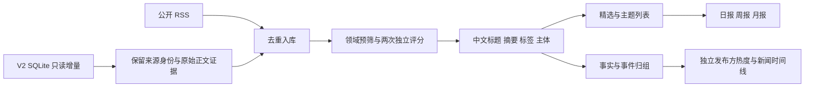

# CoreScope · 核心网与 AI 洞察

面向移动核心网设备供应商及 AI 领域的技术、架构、标准、安全、商业和战略规划人员。基于 [AIHOT 开源框架](https://github.com/KKKKhazix/AIHOT)，保留其精选时间线、热点事件、主题目录、日报/周报/月报、模型榜和管理后台，采用独立品牌与适合两个领域的内容判断规则。

## 本机运行

Windows 11、Node.js 24.11+、Python 3.12+。第一次启动需要网络下载 PostgreSQL 17 官方便携版并安装 npm 依赖；之后数据库、日志和构建均保存在本项目内，无需安装系统数据库服务。

1. 配置私有 `.env`，见 [本机运行说明](docs/CORESCOPE_LOCAL.md)。若本人授权复用已有 V2 服务，可以运行：
   ```powershell
   python scripts/corescope-configure-v2.py --v2-root "你的 V2 checkout 绝对路径"
   ```
   此操作仅只读 V2 配置与密钥，生成独立数据库/后台密码，不输出密钥。
2. 确认模型配置后，在 `.env` 中将 `MODEL_CALLS_ENABLED` 和 `COLLECT_ENABLED` 设为 `true`。首次启动使用保守请求熔断，后台“设置”可以调整；请求次数限制不是金额上限。
3. 双击 **Start-CoreScope.cmd**。浏览器打开 [http://127.0.0.1:8780](http://127.0.0.1:8780)。停止请双击 **Stop-CoreScope.cmd**，等待分析任务正常退出。

管理员入口 `/admin/login`，密码保存在本机 `.env` 的 `ADMIN_PASSWORD`。API 使用 8781，独立 PostgreSQL 使用 5448，均绑定本机。V2 和其他现有系统不需要停止。

```powershell
npm run corescope:status
npm run corescope:verify
# 两个真实模型连接检查，经过正式回执及请求熔断，可能产生费用：
node --env-file=.env scripts/corescope-operations.ts verify-models
```

## 信息链路



V2 的已有摘要与分数不是新站原始正文或新站精选结果。桥接保留原始标题、URL、发表时间、采集时间及正文证据，由新站规则重新分析。正文未经来源确认时明确标为 `unconfirmed`，不会因篇幅较长就宣称完整全文。

信源目录于 2026-10-03 融合：436 个 V2 配置排除 5 个输出循环源，合并相同采集入口，结合上游 18 个公开示例后保留 425 个 canonical 来源，174 个启用。161 个启用来源由 V2 桥接、13 个直接 RSS；停用来源不会自动重新启用。目录是配置数量，不代表每个源当前抓取都成功。来源证据、合并理由及旧 ID 映射见 [信源审计目录](docs/corescope-v2-sources.json)。

桥的事务游标是 `(updated_at,id)`，提交成功才前进；ledger 保证重复导入不重复建文章。默认从启动时水位开始持续同步，历史资料必须显式 `--bootstrap` 导入，防止一次重跑大量历史模型请求。

## 页面与内容规则

- 精选保持当前上游的时间线与卡片布局，按领域、分类、来源与时间查看；单篇展示推荐理由、内容摘要和原文链接。
- 热点是事件排名。近 48 小时同一发布方只贡献一次热度，24 小时半衰期；至少两个独立参与方且包含有效报道才能入榜。稀疏资料不会硬造热点。
- 主题是配置目录与模型标签/主体过滤，允许一篇资料出现在多个主题；它不自动生成新主题，也不把公司提及当成事件主体。
- 核心网主题覆盖 5GC、6G/标准、云原生网络、网络安全和网络 AI；AI 主题覆盖 Agent、RAG/记忆、评测、安全、基础设施及产业商业。
- 保留上游五维评分、双评分结构和原有信源分级门槛，调整领域 KnowHow 与噪声案例。门槛尚须用你的标注样本进一步校准。
- 日报按北京时间每天 08:00 截止，周报/月报按日历周期。来源发布时间、入站时间和报告生成时间分别保留。

默认公开摘要与原文链接，不再发布未获授权的来源全文。页面读取不触发模型调用；付费分析集中在 worker，保留请求回执和熔断记录。密钥、数据库、日志、安装包均不提交 Git。

## 验证与文档

```powershell
npm run typecheck
npm run corescope:test
npm run build -w @aihot/web
node --test apps/web/tests/*.test.ts
node scripts/smoke.ts --base http://127.0.0.1:8780
```

`corescope:test` 每次重建独立的临时 `corescope_test` 数据库，再迁移并移除真实模型密钥，只使用测试 HTTP stub。它拒绝重建仍有活动连接的测试库，不修改正式库。

[设计说明](docs/CORESCOPE_DESIGN.md) · [本机运行](docs/CORESCOPE_LOCAL.md) · [桥接说明](docs/CORESCOPE_V2_BRIDGE.md) · [交付验收](docs/CORESCOPE_ACCEPTANCE.md) · [热点与主题机制](docs/CORESCOPE_MECHANISM.md) · [行业定制](docs/customize.md) · [部署](docs/deploy.md)

本版本首先交付本机完整系统。外网部署需要配置域名、访问策略及运维，不属于本机启动脚本。保留上游 MIT 许可证与版权声明，品牌和行业定制不代表上游作者认可。
